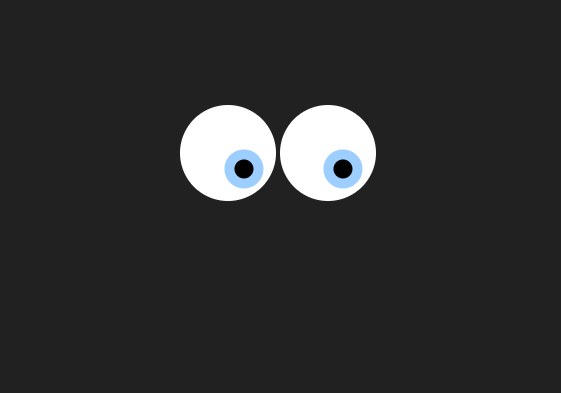
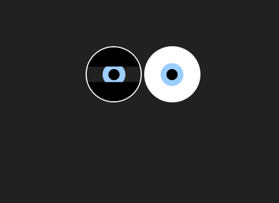

# Tracking Eyes Background

## Overview
"Tracking Eyes Background" is a creative web project that simulates eye tracking effects with blinking animations. The eyes follow the cursor movement and blink periodically for a dynamic visual experience.

## Features
- Eye tracking effect following cursor movement.
- Smooth blinking animation.
- Fully responsive design (mobile-friendly).
- Lightweight and minimalistic.

## How It Works
1. The eyes track the movement of the cursor.
2. Blinking animation is triggered periodically for a more realistic experience.
3. The eyes respond to user interactions smoothly.

## Screenshots
1. Eye Tracking Animation:
   
   
2. Eye Blinking Animation:
   

## How to Use
1. Clone the repository or download the files.
2. Open the `index.html` file in any modern web browser.
3. Enjoy the interactive eye tracking background effect.

## Future Enhancements
- Add customization options for colors and animations.
- Improve accessibility and mobile responsiveness further.
- Implement additional eye tracking behaviors.
- Optimize performance for even better efficiency.

----
We welcome contributions! If you'd like to contribute you can.
